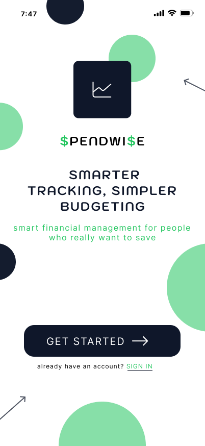

# SpendWise – Smart Personal Finance & Expense Tracking App

## Overview

SpendWise is a mobile UI/UX case study designed as part of a UI/UX Design Internship Task.

The application helps users track expenses, manage budgets, analyze spending patterns, and improve financial awareness through a clean and intuitive user experience.

---

## Problem Statement

Many users perform daily financial transactions but often struggle to understand where their money is being spent and how much budget remains for the month.

SpendWise aims to simplify expense tracking through a user-friendly mobile application that provides financial clarity and meaningful insights.

---

## Features

* Splash / Welcome Screen
* Login & Authentication Screen
* Expense Dashboard
* Add Expense Interface
* Monthly Analytics & Insights
* Profile & Settings Management

---

## User Flow

Splash Screen
→ Login / Sign Up
→ Home Dashboard
→ Add Expense
→ Analytics
→ Profile

---

## Design Tools

* Figma
* Material Icons
* Google Fonts

---

## Screens

### Splash Screen

### Login Screen

### Home Dashboard

### Add Expense Screen

### Analytics Screen

### Profile Screen

## Figma Prototype

https://www.figma.com/proto/09JQW4Xr6Ra9Uh4hT1rz0f/spendwise-fintech-app?node-id=0-1&t=KErn4mmG3ABnOZy1-1

## Project Report

Refer to UIUX_Task1_Report.pdf

---

### Author

Hadassah
UI/UX Design Internship – Task 1
